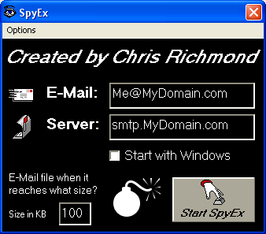



## SpyEx 2\.0 \(UPGRADE\)

### Description

SpyEx runs with windows in the background and logs the time, keys pressed, and window title of every place you've been. Each time the user switches to a new window the report is automatically updated. Now you can have SpyEx e-mail the report every time the file gets to a certain size! Also, SpyEx now accepts command-line arguments, so you can change the set options. Want to know what your kids or employees are doing, or maybee to see what's going on at your computer? Well here's your chance. Let me know what you think.

The dll file to send email was automatically removed when I submitted the code. You can go to http://www.spyex.net to download the dll.
 
### More Info
 

             |
---                |---
**Submitted On**   |2004-01-19 11:26:04
**By**             |[Chris Richmond](https://github.com/Planet-Source-Code/PSCIndex/blob/master/ByAuthor/chris-richmond.md)
**Level**          |Intermediate
**User Rating**    |4.8 (53 globes from 11 users)
**Compatibility**  |VB 5\.0, VB 6\.0, VB Script
**Category**       |[Complete Applications](https://github.com/Planet-Source-Code/PSCIndex/blob/master/ByCategory/complete-applications__1-27.md)
**World**          |[Visual Basic](https://github.com/Planet-Source-Code/PSCIndex/blob/master/ByWorld/visual-basic.md)
**Archive File**   |[SpyEx\_2\_0\_1696601192004\.zip](https://github.com/Planet-Source-Code/chris-richmond-spyex-2-0-upgrade__1-51110/archive/master.zip)

### API Declarations

Too Many to list

